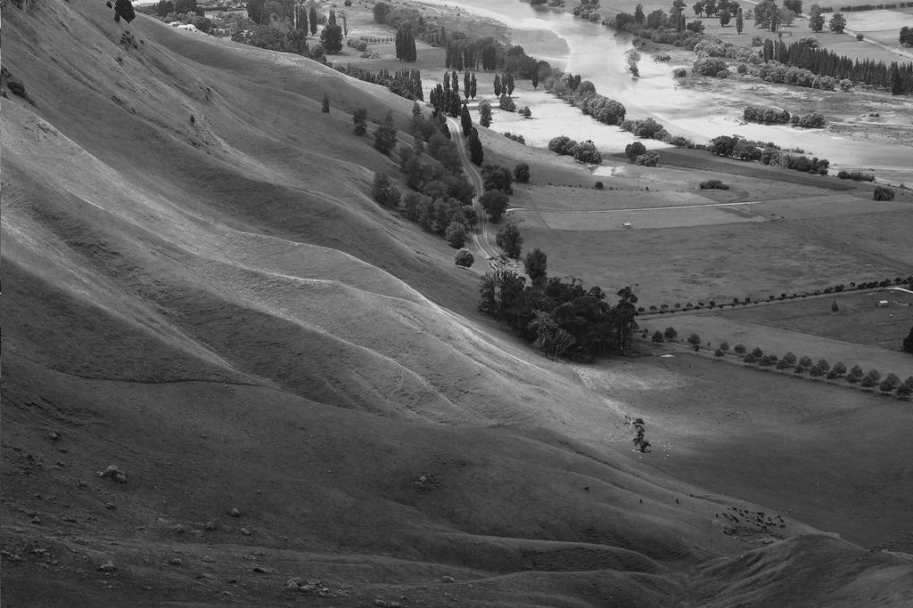

# Histogram Equalization with Phyton

This script takes grayscale pictures and spreads out their colour range to the fullest. Sometimes grayscale pictures look dull or foggy because they don't use the full range of possible gray colours. This script uses the formula described in [Wikipedia](https://de.wikipedia.org/wiki/Punktoperator_(Bildverarbeitung)#Histogrammspreizung_und_-stauchung) and applies it pixel by pixel on the given picture.

This example picture is taken from Wikimedia and belongs to [Phillip Capper](https://commons.wikimedia.org/wiki/File:Hawkes_Bay_NZ.jpg).


And this is the result of the script.


## Installation
The script tries to use a minimum amount of modules, but still needs one; Pillow. Install it with

```bash
$ pip install pillow
```

## Usage
This script takes a picture and puts out the processed picture as 'out.bmp' in the destination of the script.

```bat
Usage: HistogrammEqualization.py <Image File>
```
